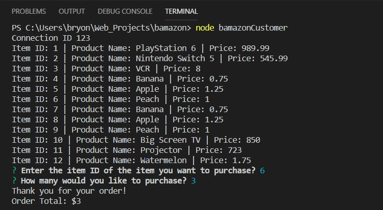
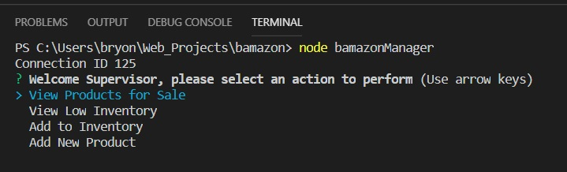
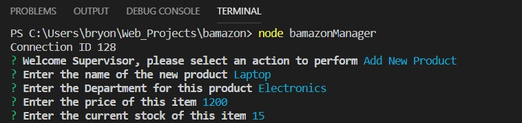

# bamazon

This Application uses Node.js, Inquirer and MySQL to present users with some actions to perform that query, update and insert into a database.

### How bamazonCustomer works
This application has 2 options to run.  Running bamazonCustomer will let the user order items and have the database updated to reflect the order.  Running bamazonManager will present the user with 4 options that will query, update or insert into the database.

### Instructions for using bamazonCustomer
Upon running bamazonCustomer, the user is shown the products in the database and asked to enter the item ID of the item they would like to purchase.  After making their selection, the order total is shown to the user and quantity ordered is removed from the stock quantity in the database.

### Instructions for using bamazonManager
Upon running bamazonManager, the user is presented with 4 options.

* View Products for Sale - This will query the database and present the list of products for sale.

* View Low Inventory - This will query the database and present a list of produ
* Add New Product - This will ask the user to the enter a Product Name, Product Department, Price and Stock Quantity.  Data entered will then be inserted into the database.

### Technologies used
* Javascript
* Node.js
* MySQL
* Inquirer
